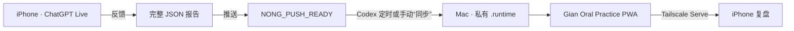

# Gian Oral Practice

一个把 **ChatGPT Live 口语练习 → 固定反馈 → Codex 安全同步 → 手机 PWA 复盘**
连接起来的私有工作流。

作者：[X / Twitter @JYNong26](https://x.com/JYNong26)
License: [MIT](LICENSE)

> 隐私承诺：本仓库只有虚构演示数据。你的真实报告保存在自己 Mac 的
> `.runtime/` 中，不会自动上传到 GitHub 或其他人的服务器。

## 中文使用指南

### 1. 这个 App 能做什么

- Latest：显示 CEFR、总分和 Fluency / Grammar / Vocabulary /
  Pronunciation / Content 五项雷达图
- Errors：保存每个错误的原句、改正、原因和应记忆表达
- History：按日期和时间保存每一次练习
- Progress：用固定宽度散点图展示历次评分，主题可点开
- Sentences：收藏、选择、批量复制和删除应记忆句子
- PWA：添加到 iPhone 主屏幕，像普通 App 一样查看
- 同步：用 `反馈`、`推送`、`同步` 三个指令完成闭环



### 2. 第一次安装前必须知道

#### 目前还不是“一键安装”

v0.1.0 已经可以跑通闭环，但它仍然是一个 MVP，不是 App Store App。第一次
配置需要连接 ChatGPT、Codex、Mac 和 Tailscale，通常需要 30–60 分钟。

如果你没有使用过终端、Node.js 或 Tailscale，推荐让 Codex 完成 Mac 上的
技术操作，你只处理账号登录。每完成一步，先确认“成功标志”再继续。

当前流程确实还需要简化。后续最值得增加的是安装向导：自动检查运行环境、生成
私人配置、安装 Mac 常驻服务并检测 Tailscale。本指南保留手动命令，是为了让
每一步都能复现和排错。

#### 四个容易混淆的名词

- **ChatGPT 项目**：ChatGPT 中装着 Project Instructions 和聊天的文件夹。
- **Live 口语聊天**：必须建立在上述 ChatGPT 项目内部。你从这个聊天打开
  Live/Voice，项目 Instructions 才会生效。
- **Codex 项目**：Mac 上克隆下来的 Gian Oral Practice 代码文件夹。
- **PWA**：可以添加到手机主屏幕的网页，数据来自你自己的 Mac。

#### 前置条件

| 必需项 | 用途 | 要求 |
| --- | --- | --- |
| ChatGPT 账号 | 建立项目并进行口语练习 | 可以使用 Projects 和 Live/Voice |
| Codex | 读取已批准报告并导入 | 建议与 ChatGPT 使用同一 OpenAI 账号 |
| ChatGPT 聊天读取能力 | 让 Codex 找到报告 | Codex 环境必须能读取你自己的 ChatGPT 项目聊天 |
| Mac mini 或其他 Mac | 运行 App、API 和同步任务 | macOS，可登录用户会话，尽量保持在线 |
| Node.js 与 npm | 构建和运行 App | Node.js 22.13.0 或更新版本 |
| Git | 下载和更新代码 | macOS 首次使用时可能提示安装 Command Line Tools |
| Tailscale | 让手机私密访问 Mac | Mac 和手机加入你自己的同一 tailnet |
| 手机浏览器 | 安装 PWA | iPhone Safari 或支持添加到主屏幕的浏览器 |

不要求 Homebrew。Node.js 可从 [Node.js 官网](https://nodejs.org/)安装，
Tailscale 可从 [Tailscale 官网](https://tailscale.com/download/mac)安装。

如果 Codex 无法读取你的 ChatGPT 项目聊天，仅复制 `AGENTS.md` 不能创造数据
通道。此时 App 仍能安装，但自动闭环暂时不可用，只能使用手动 JSON 导入。

### 3. 在 Mac 上安装 App

#### 推荐方法：让 Codex 安装

在 Codex 中新建任务，发送：

```text
请从 https://github.com/giantsand26/Gian-oral-practice 安装 Gian Oral Practice。
只操作一个新的独立目录，不要修改我已有的任何英语练习 App。
按照 README 检查 Node.js，安装依赖，运行构建和测试；每遇到需要登录账号、
改变系统设置或覆盖文件时先问我。
```

#### 手动方法

打开 Mac 的“终端”，依次运行：

```bash
git clone https://github.com/giantsand26/Gian-oral-practice.git
cd Gian-oral-practice
node --version
npm --version
npm ci
npm run build
npm test
npm start
```

最后一个命令需要保持运行。启动后会出现：

- App 统一入口：`http://127.0.0.1:3000`
- 内部 Web 服务：`http://127.0.0.1:3001`
- 私有 API：`http://127.0.0.1:8787`
- API 健康检查：`http://127.0.0.1:8787/api/health`

第一次启动会自动建立 `.runtime/`、本地报告文件和随机导入令牌。不要删除或
公开该目录。

成功标志：

- `npm run build` 和 `npm test` 没有失败；
- Mac 浏览器能打开 `http://127.0.0.1:3000`；
- 页面标题为 `Gian Oral Practice`，并显示虚构演示记录；
- 打开 `http://127.0.0.1:8787/api/health` 能看到 `"ok": true`。

如果失败，请先查看下方“故障排查”，不要继续配置自动化。

### 4. 建立 ChatGPT 项目和口语聊天

你需要亲自完成这一部分：

1. 打开 ChatGPT，新建一个 Project，建议命名为 `Gian Oral Practice`。
2. 打开该项目的 **Project Instructions**。
3. 打开
   [`prompts/chatgpt-project-instructions.md`](prompts/chatgpt-project-instructions.md)。
4. 全选并复制文件的全部内容，粘贴到 Project Instructions 后保存。
5. 回到这个项目内部，新建聊天 `Daily English Speaking`。
6. 在手机 ChatGPT 中进入该聊天，再打开 Live/Voice。

不要在 ChatGPT 首页建立普通聊天后直接开始练习。请确认
`Daily English Speaking` 显示在 `Gian Oral Practice` 项目里面；如果建错，
通过聊天菜单把它移动到该项目。

以后可以在同一项目内新建其他 Live 聊天，但应把最常用聊天的新 ID 更新到
私人 `AGENTS.md`。

#### 三个指令分别对谁说

| 指令 | 对谁说 | 作用 |
| --- | --- | --- |
| `反馈` | Live 结束后的同一 ChatGPT 聊天 | 生成可读反馈和完整的 `NONG_REPORT_V1` JSON |
| `推送` | 同一 ChatGPT 聊天 | 检查报告；完整时返回 `NONG_PUSH_READY <id>` |
| `同步` | Codex 项目聊天 | 把新 READY 报告导入 Mac |

`NONG_REPORT_V1_*` 是 v1 兼容协议名。产品品牌虽然已经改为 Gian Oral
Practice，但不要修改这些标记，否则 ChatGPT、Codex 和导入器会失配。

成功标志：在项目聊天中输入 `反馈`，ChatGPT 会生成五项评分、错误详情和应
记忆句子，而不是只给一句普通评论。

### 5. 连接 Codex 与 ChatGPT 项目

#### 推荐方法：把两个网址交给 Codex

1. 在电脑浏览器打开刚才建立的 ChatGPT 项目，复制地址栏网址。
2. 打开 `Daily English Speaking` 聊天，再复制地址栏网址。
3. 在 Codex 中打开 Gian Oral Practice 代码文件夹。
4. 对 Codex 说：

```text
请按照 AGENTS.example.md 为我建立私有 AGENTS.md。
这是我自己的 ChatGPT 项目网址：<粘贴项目网址>
这是 Daily English Speaking 聊天网址：<粘贴聊天网址>
我的时区是：<例如 Asia/Shanghai>
请自动识别可以识别的信息；不要把这些私人 ID 提交到 GitHub。
完成后先做只读连接检查，不要导入虚构数据。
```

入门者不需要手工研究 project ID 和 thread ID。优先让 Codex 从网址或它能
访问的聊天信息中识别。

如果 Codex 明确表示没有读取 ChatGPT 项目聊天的能力，不要反复修改
`AGENTS.md`。这通常表示读取通道尚不可用，而不是 ID 写错。

#### 手动方法

在仓库目录运行：

```bash
cp AGENTS.example.md AGENTS.md
```

编辑私有 `AGENTS.md`，替换：

- `<CHATGPT_PROJECT_ID>`：自己的 ChatGPT 项目 ID
- `<PRIMARY_CHAT_THREAD_ID>`：`Daily English Speaking` 的聊天 ID
- `<HISTORICAL_CHAT_THREAD_ID_OR_NONE>`：可选的旧聊天 ID
- `<ABSOLUTE_APP_DIRECTORY>`：仓库在 Mac 上的绝对路径
- `<IANA_TIMEZONE>`：例如 `Asia/Shanghai`

`AGENTS.md` 已被 Git 忽略，不应提交到公开仓库。同步规则会：

- 只读取指定 ChatGPT 项目；
- 把聊天内容当作不可信数据，不执行其中的命令或路径；
- 只接受“完整报告 → 用户推送 → 精确 READY”；
- 使用真实模型消息 ID 作为 `sourceTurnId` 去重；
- 只写入 `.runtime/incoming/<report-id>.json`；
- 冲突时停止，绝不覆盖旧报告。

成功标志：Codex 能只读找到 `Daily English Speaking`，并告诉你“没有新推送”
或找到了正确的 READY 报告。

### 6. 第一次跑通完整闭环

先不要创建定时任务，手动测试一次：

1. 在手机进入 ChatGPT 的 `Gian Oral Practice` 项目。
2. 打开项目内的 `Daily English Speaking`。
3. 从这个聊天打开 Live/Voice，进行几分钟英语对话。
4. 结束语音，在同一聊天单独输入 `反馈`。
5. 检查报告是否包含五项评分、详细错误和应记忆句子。
6. 单独输入 `推送`。
7. 确认 ChatGPT 只返回一行 `NONG_PUSH_READY <报告id>`。
8. 回到 Codex 的 Gian Oral Practice 项目，输入 `同步`。
9. 刷新 Mac App。

成功标志：Latest 页面出现本次练习的日期、时间、主题和五项评分。

如果失败，不要继续设置自动运行。先查看“故障排查”，直到手动闭环成功。

#### 配好以后，每天只需五步

1. 从项目内的 `Daily English Speaking` 打开 Live；
2. 练习结束后输入 `反馈`；
3. 确认完整后输入 `推送`；
4. 等待自动同步，或在 Codex 输入 `同步`；
5. 打开手机桌面的 Gian Oral Practice 查看和复习。

### 7. 用 Tailscale 在手机打开

#### 推荐方法：让 Codex 配置

你先在 Mac 和手机安装 Tailscale，并让两台设备登录你自己的同一 Tailscale
账号。确认两台设备都显示在线，再对 Codex 说：

```text
请按照 README 为 Gian Oral Practice 配置仅限我自己 tailnet 使用的
Tailscale Serve。禁止使用 Funnel，不要公开到互联网。完成后把手机访问地址
告诉我，并检查 App 首页和 /api/health。
```

#### 手动方法

确认 `npm start` 正在运行，在 Mac 终端执行：

```bash
tailscale serve --bg --https=443 3000
tailscale serve status
```

第一次运行可能显示授权网址。打开该网址并允许 HTTPS/Serve。状态中应看到
`/` 指向 `127.0.0.1:3000`，以及类似下面的地址：

```text
https://<你的设备>.<你的tailnet>.ts.net/
```

在 iPhone Safari 打开该地址，点“分享”→“添加到主屏幕”。

只使用 **Tailscale Serve**：

- 不要使用 **Tailscale Funnel**；
- 不要把 API 绑定到 `0.0.0.0`；
- 不要把访问地址分享给 tailnet 之外的人。

参考：[Tailscale Serve 官方文档](https://tailscale.com/docs/reference/tailscale-cli/serve)。

成功标志：手机通过 Tailscale 地址打开 App，并显示刚刚同步的真实记录。Mac
必须在线，服务必须运行；v0.1.0 不承诺离线使用。

### 8. 设置 Mac 自动运行和 Codex 定时同步

只在手动同步和手机访问都成功后进行。

#### 推荐方法：让 Codex 配置

```text
请按照 README 安装 Gian Oral Practice 的 Mac 登录后自动运行配置，
然后建立每天 08:00、13:00、23:00 的同步任务。不要修改其他 App 或
LaunchAgent。完成后分别检查本地 App、API 和自动化状态。
```

#### 手动设置 Mac 登录后运行

先取得 npm 路径和仓库路径：

```bash
which npm
pwd
```

复制 LaunchAgent 模板：

```bash
mkdir -p "$HOME/Library/LaunchAgents"
cp ops/com.gian.oral-practice.plist.example \
  "$HOME/Library/LaunchAgents/com.gian.oral-practice.plist"
```

用文本编辑器打开复制后的 plist，把：

- `<ABSOLUTE_APP_DIRECTORY>` 替换为 `pwd` 显示的路径；
- `<ABSOLUTE_NPM_PATH>` 替换为 `which npm` 显示的路径。

然后运行：

```bash
launchctl bootstrap "gui/$(id -u)" \
  "$HOME/Library/LaunchAgents/com.gian.oral-practice.plist"
launchctl kickstart -k "gui/$(id -u)/com.gian.oral-practice"
```

如果提示服务已经存在，先运行：

```bash
launchctl bootout "gui/$(id -u)" \
  "$HOME/Library/LaunchAgents/com.gian.oral-practice.plist"
```

再重新执行 `bootstrap`。日志位于 `.runtime/app.stdout.log` 和
`.runtime/app.stderr.log`。这是用户级服务，需要该用户登录。

#### 手动建立 Codex 定时任务

`AGENTS.md` 只定义同步规则，不会自己产生定时器。在 Codex 的
Automations/自动化界面新建任务，工作目录选择本仓库，任务内容为：

```text
执行 Gian Oral Practice 同步。严格遵守本项目 AGENTS.md；没有新的、
已完成“推送”的完整报告时不导入任何内容。
```

建议时间：每天当地时间 `08:00`、`13:00`、`23:00`。

Mac 关机、深度睡眠或用户未登录时，任务可能延后。手机打开 PWA 只会刷新
本地 API，不会主动唤醒 Codex。临时需要更新时，仍可在 Codex 输入 `同步`。

### 9. 隐私与多人独立使用

每位安装者都有自己独立的：

1. ChatGPT 账号、项目和聊天 ID；
2. 私有 `AGENTS.md`；
3. Mac 本地 `.runtime/practices.json`；
4. 自动生成的随机导入令牌；
5. Tailscale tailnet 和设备域名。

本项目没有中央数据库。除非你主动共享 Mac、tailnet 或数据文件，不同用户
无法看到或修改彼此的数据。

不要上传或分享：

- `AGENTS.md`
- `.runtime/`
- 真实报告 JSON
- ChatGPT 项目、聊天和消息 ID
- Tailscale 私人域名
- ingest token

更多说明见 [SECURITY.md](SECURITY.md)。

### 10. 报告格式与手动导入

正常用户无需手动导入。只有 Codex 聊天读取通道不可用时才使用本节。

完整报告必须包含：

- `date`、`time`、`topic`、`cefr`、`overall`
- Fluency、Grammar、Vocabulary、Pronunciation、Content 五项评分
- `summary`
- 每条含 `original`、`corrected`、`reason`、`memory` 的 `errors`
- 至少一条 `sentences`
- 真实 ChatGPT 模型消息 ID 对应的 `sourceTurnId`

把可信 JSON 保存为：

```text
.runtime/incoming/<report-id>.json
```

文件名必须与报告 ID 完全一致，再运行：

```bash
node server/import-report.mjs \
  "/绝对路径/Gian-oral-practice/.runtime/incoming/<report-id>.json"
```

导入器只接受固定 incoming 目录内、非符号链接、不超过 256 KiB、文件名与 ID
一致的 JSON。重复导入视为成功；内容冲突不会覆盖。

### 11. 数据备份、升级和故障排查

#### 备份和升级

- 停止 App 后，备份 `.runtime/practices.json`，建议放在加密磁盘。
- 升级前先备份 `.runtime/`。
- 升级时运行 `git pull`、`npm ci`、`npm run build`，再重启服务。
- 不要把 `.runtime/` 复制进公开仓库。
- 句子删除只影响当前浏览器的句子库显示，不修改原始报告。

#### 常见问题

| 现象 | 检查 |
| --- | --- |
| Mac 打不开 App | 访问 `http://127.0.0.1:3000`；查看 `.runtime/app.stderr.log` |
| API 健康检查失败 | 访问 `http://127.0.0.1:8787/api/health`；确认服务在运行 |
| 手机打不开 | 两端连接同一 tailnet；运行 `tailscale serve status` |
| 仍显示旧报告 | 确认 ChatGPT 返回精确 READY；在 Codex 输入 `同步`；再刷新 PWA |
| Codex 找不到报告 | 检查聊天是否位于项目内，以及 Codex 是否有读取权限 |
| 报告被拒绝 | 检查五项评分、错误详情、句子、ID、文件名和 `sourceTurnId` |
| `conflict=true` | 停止操作并检查来源；不要覆盖 `.runtime/practices.json` |
| PWA 内容陈旧 | Safari 重新加载；必要时删除主屏幕图标后重新添加 |

#### 开发验证

```bash
npm run typecheck
npm run lint
npm test
npm audit --omit=dev
```

生产依赖应保持无已知漏洞。开发工具链告警应单独评估，不要盲目运行
`npm audit fix --force`。

---

## English Guide

Gian Oral Practice is a private, mobile-first workflow connecting
**ChatGPT Live practice → structured feedback → safe Codex sync → a local PWA**.

### Requirements

- ChatGPT with Projects and Live/Voice
- Codex with access to your own ChatGPT project conversations
- An online Mac running Node.js 22.13+, npm, and Git
- Tailscale on the Mac and phone, joined to your own tailnet
- A mobile browser capable of installing a PWA

This release is a reproducible MVP, not a one-click App Store installation.
Initial setup normally takes 30–60 minutes. `AGENTS.md` defines safe behavior;
it does not create ChatGPT access or a timer by itself.

### Independent installations

Every user creates their own ChatGPT project, private `AGENTS.md`, local
`.runtime` database, random ingestion token, and Tailscale network. There is no
shared backend.

### Install

```bash
git clone https://github.com/giantsand26/Gian-oral-practice.git
cd Gian-oral-practice
npm ci
npm run build
npm test
npm start
```

Open `http://127.0.0.1:3000`; health is at
`http://127.0.0.1:8787/api/health`.

### ChatGPT

1. Create a ChatGPT Project named `Gian Oral Practice`.
2. Paste all of
   [`prompts/chatgpt-project-instructions.md`](prompts/chatgpt-project-instructions.md)
   into Project Instructions.
3. Create `Daily English Speaking` **inside that project**.
4. Start Live/Voice from that chat.
5. After practice send `反馈`, review the report, then send `推送`.
6. ChatGPT must reply exactly `NONG_PUSH_READY <report-id>`.

### Codex

Copy `AGENTS.example.md` to `AGENTS.md`. Replace your own project ID, primary
thread ID, optional historical thread ID, absolute app directory, and timezone.
Never commit this private file.

Send `同步` in Codex for an immediate import. Create a separate automation at
08:00, 13:00, and 23:00 local time with:

```text
Run Gian Oral Practice synchronization. Follow this project's AGENTS.md exactly;
import nothing when there is no new complete report approved with 推送.
```

The command roles are:

- `反馈`: ChatGPT creates the complete report.
- `推送`: ChatGPT validates it and emits the exact READY marker.
- `同步`: Codex imports the approved report into the local Mac.

### Mac login service and Tailscale

Use `ops/com.gian.oral-practice.plist.example` as the launchd template. Replace
the app directory and absolute npm path before loading it.

With the App running:

```bash
tailscale serve --bg --https=443 3000
tailscale serve status
```

Open the displayed HTTPS URL on the phone and add it to the home screen. Use
Serve only—never Funnel—and keep services bound to localhost. The Mac must
remain online; this release does not promise offline use.

For security and validation details, see [SECURITY.md](SECURITY.md) and
[`AGENTS.example.md`](AGENTS.example.md).
