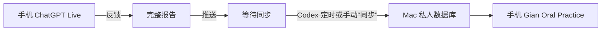

# Gian Oral Practice

一个把 **ChatGPT Live 口语练习 → 固定反馈 → Codex 自动同步 → 手机复盘**
连接起来的私人英语学习 App。

作者：[X / Twitter @JYNong26](https://x.com/JYNong26)
License: [MIT](LICENSE)

> 本仓库只有虚构演示数据。你的真实报告只保存在自己的 Mac，不会自动上传到
> GitHub，也不会与其他安装者共享。

## 中文小白安装指南

这是一条单一安装路线。普通用户不需要打开终端，不需要理解代码，不需要手工
寻找 ID，也不需要编辑 plist。需要执行的技术操作全部交给 Codex。

### 开始前：确认这条路线适合你

请逐项确认：

- 有一台可以保持在线的 Mac mini 或其他 Mac；
- Mac 上可以使用 Codex；
- 手机 ChatGPT 可以使用 Projects 和 Live/Voice；
- Codex 可以读取你自己的 ChatGPT 项目聊天；
- Mac 和手机都可以安装 Tailscale；
- ChatGPT 和 Codex 建议登录同一个 OpenAI 账号。

只有以上条件全部满足，自动闭环才能跑通。

如果 ChatGPT 没有 Projects/Live，或者 Codex 明确表示无法读取 ChatGPT 项目
聊天，请先停止。`AGENTS.md` 和 README 不能创造账号尚未具备的权限。App
仍可安装，但报告只能手动导入。

### 你最终会得到什么

- Latest：最新一次练习的 CEFR、总分和五项雷达图
- Errors：错误原句、正确表达、原因和记忆提示
- History：所有练习记录
- Progress：历次练习的评分变化
- Library：每次练习精选 1–4 个最佳句子；重点搭配每次最多 5 个，均可勾选、全选、复制和删除
- 手机 PWA：添加到主屏幕，像 App 一样打开

完整流程是：



## 第一步：建立 ChatGPT 项目

这一部分必须由你本人操作。

1. 打开 ChatGPT。
2. 新建一个 Project，命名为 `Gian Oral Practice`。
3. 打开这个项目的 **Project Instructions**。
4. 打开
   [`prompts/chatgpt-project-instructions.md`](prompts/chatgpt-project-instructions.md)。
5. 全选并复制文件中的全部文字。
6. 粘贴到 Project Instructions，保存。
7. 回到 `Gian Oral Practice` 项目内部。
8. 在项目内部新建聊天，命名为 `Daily English Speaking`。

请确认 `Daily English Speaking` 显示在 `Gian Oral Practice` 项目里面。
如果它在 ChatGPT 首页而不在项目里，请通过聊天菜单把它移动到项目。

成功标志：

- 打开的是项目内的 `Daily English Speaking`；
- 在聊天中输入 `反馈`，ChatGPT 知道要生成五项评分、错误详情和应记忆句子。

## 第二步：登录 Tailscale

1. 在 Mac 安装并登录 Tailscale。
2. 在手机安装并登录 Tailscale。
3. 两边必须登录同一个、属于你自己的 Tailscale 账号。
4. 在 Tailscale 设备列表确认 Mac 和手机都显示在线。

此时不要运行任何 Tailscale 命令，后面由 Codex 自动配置。

成功标志：Mac 和手机能在同一个 Tailscale 设备列表中看到彼此。

## 第三步：复制两个 ChatGPT 网址

请在电脑浏览器操作：

1. 打开 `Gian Oral Practice` ChatGPT 项目，复制地址栏网址。
2. 打开项目内的 `Daily English Speaking`，复制地址栏网址。
3. 暂时把这两个网址保存在备忘录中。

这两个网址属于私人配置信息，不要发到 GitHub 或公开群聊。

## 第四步：把安装工作完整交给 Codex

在 Codex 中新建一个任务，把下面整段文字发送给 Codex。只需要把尖括号中的
两处内容替换成第三步复制的网址。

```text
请为我从零安装并配置 Gian Oral Practice。

公开仓库：
https://github.com/giantsand26/Gian-oral-practice

我的 ChatGPT 项目网址：
<粘贴 Gian Oral Practice 项目网址>

我的 Daily English Speaking 聊天网址：
<粘贴 Daily English Speaking 聊天网址>

要求：
1. 安装到一个新的独立目录，禁止修改我已有的任何英语练习 App。
2. 先检查 Node.js、npm、Git 和 Tailscale；缺少软件时告诉我去哪个官方网站安装。
3. 下载代码、安装依赖、构建并运行全部测试。
4. 根据 AGENTS.example.md 建立只在本机保存的 AGENTS.md，自动填写我的项目、
   聊天、App 路径和本地时区；禁止把私人 ID 提交到 GitHub。
5. 启动 App 和本地 API，确认首页与 /api/health 正常。
6. 获取我自己的准确 Tailscale HTTPS 主机名，把它写入此 App 的
   GIAN_ALLOWED_HOSTS，再使用 Tailscale Serve 提供仅限我自己 tailnet 的
   手机访问地址。禁止使用 Funnel，禁止公开到互联网，也不要允许任意 Host。
7. 配置 Mac 登录后自动运行，只创建 Gian Oral Practice 自己的 LaunchAgent，
   不得修改其他 App 或 LaunchAgent。
8. 创建每天 08:00、13:00、23:00 的 Codex 同步任务。
9. 完成后检查：本地 App、API、Tailscale 手机地址、同步规则和自动化状态。
10. 遇到账号登录、系统授权、覆盖文件或无法确认的私人配置时暂停并问我；
    其他安全且可逆的安装步骤直接完成。
11. 最后用小白能看懂的方式告诉我：哪些已完成、手机应该打开哪个地址、
    如何做第一次练习测试。
```

然后等待 Codex 工作。期间 Codex 可能会要求你：

- 安装 Node.js；
- 登录 GitHub 或 Tailscale；
- 同意 macOS 系统权限；
- 提供无法从网址自动识别的信息。

按照 Codex 的提示完成即可，不需要自己补充终端命令。

安装成功必须同时满足：

- Codex 明确告诉你构建和测试通过；
- Mac 本地 App 可以打开；
- API 健康检查正常；
- Codex 能只读找到 `Daily English Speaking`；
- Codex 给出一个 Tailscale HTTPS 手机地址；
- Codex 显示每天三个同步时间已经建立；
- Codex 确认没有修改其他英语练习 App。

如果 Codex 没有确认其中某一项，请直接问：

```text
上面的安装成功检查还有哪一项没有通过？请继续排查，不要跳过。
```

### 默认自动同步时间

安装指令默认让 Codex 按你的本地时区每天同步三次：

- 早上 `08:00`
- 中午 `13:00`
- 晚上 `23:00`

这三个时间只是默认值，可以根据自己的练习习惯调整。需要修改时，在 Codex 的
Gian Oral Practice 任务中说：

```text
请把 Gian Oral Practice 的自动同步时间改为每天 <填写你需要的时间>，
使用我的本地时区，其他同步规则保持不变。
```

定时同步之外，任何时候在 Codex 中输入 `同步`，都可以立即检查并导入已经完成
“推送”的新报告。手机打开 App 只会刷新 Mac 中已有的数据，不会代替 Codex
执行报告同步。

## 第五步：做第一次真实练习测试

在手机 ChatGPT 中：

1. 打开 `Gian Oral Practice` 项目。
2. 进入项目内的 `Daily English Speaking`。
3. 从这个聊天打开 Live/Voice。
4. 进行几分钟英语对话。
5. 结束语音后，在同一聊天单独输入：

```text
反馈
```

6. 确认报告中出现：
   - Fluency
   - Grammar
   - Vocabulary
   - Pronunciation
   - Content
   - 详细错误
   - 从本次聊天中比较后精选的 1–4 个最佳句子
   - 1–5 个重点搭配
7. 再单独输入：

```text
推送
```

8. ChatGPT 应只返回类似：

```text
NONG_PUSH_READY <报告id>
```

9. 回到 Codex 的 Gian Oral Practice 任务，输入：

```text
同步
```

10. 等 Codex 告诉你导入成功。
11. 用手机打开 Codex 给你的 Tailscale HTTPS 地址。

成功标志：Latest 页面显示刚才练习的日期、时间、主题和五项评分。

如果仍然是演示记录，把下面这句话发给 Codex：

```text
我已经在 Daily English Speaking 完成“反馈”和“推送”，但手机 App 没有显示
新记录。请只读检查 ChatGPT READY 标记、sourceTurnId、本地导入结果、API 和
App 刷新状态；不要生成假报告，不要覆盖已有记录。
```

## 配好以后，每天只做五件事

1. 从项目内的 `Daily English Speaking` 打开 Live；
2. 练习结束后输入 `反馈`；
3. 确认完整后输入 `推送`；
4. 等待自动同步，或在 Codex 输入 `同步`；
5. 打开手机桌面的 Gian Oral Practice 复习。

不需要每天打开 Codex，也不需要每天运行安装命令。只有需要立即更新时才输入
`同步`。

## 三个指令不要混淆

| 指令 | 在哪里输入 | 作用 |
| --- | --- | --- |
| `反馈` | ChatGPT 口语聊天 | 生成完整报告 |
| `推送` | 同一个 ChatGPT 聊天 | 确认报告可以同步 |
| `同步` | Codex 项目任务 | 把报告导入自己的 Mac |

`NONG_REPORT_V1_*` 是兼容协议名。即使产品名是 Gian Oral Practice，也不要
修改这些标记。

## 每位使用者彼此独立

每个人都使用自己的：

- ChatGPT 账号、项目和聊天；
- 私人 `AGENTS.md`；
- Mac 本地 `.runtime` 数据库；
- 随机导入令牌；
- Tailscale 账号、tailnet 和设备地址。

本项目没有中央数据库。除非你主动共享 Mac、tailnet 或数据文件，其他安装者
不能看到或改变你的记录。

不要上传或分享：

- `AGENTS.md`
- `.runtime/`
- 真实报告 JSON
- ChatGPT 项目、聊天和消息 ID
- Tailscale 私人域名
- ingest token

更多说明见 [SECURITY.md](SECURITY.md)。

## 小白故障处理

不要自己猜命令。把对应文字复制给 Codex：

| 问题 | 发给 Codex |
| --- | --- |
| Mac 打不开 App | `请检查 Gian Oral Practice 的 App、API、LaunchAgent 和错误日志，只修复这个 App。` |
| 手机打不开 | `请检查两端 Tailscale 是否在线、Serve 状态和 HTTPS 地址，禁止使用 Funnel。` |
| 没有最新报告 | `请检查 READY 标记、同步记录、本地导入和 API，不要生成假报告。` |
| Codex 找不到聊天 | `请检查聊天是否位于正确的 ChatGPT 项目，以及当前环境是否有读取权限。` |
| 出现 `conflict=true` | `请停止覆盖，比较来源和已有记录，告诉我冲突原因。` |
| 手机仍显示旧页面 | `请检查 App 前台刷新、API 返回和 PWA 缓存，不要删除真实记录。` |

## 高级用户

需要手动安装、LaunchAgent、Tailscale 命令、报告导入、备份和开发测试时，请看：

[中文高级手动安装与维护](docs/ADVANCED_SETUP_ZH.md)

---

## English Guide

Gian Oral Practice is a private, mobile-first workflow connecting
**ChatGPT Live practice → structured feedback → safe Codex sync → a local PWA**.

### Requirements

- ChatGPT with Projects and Live/Voice
- Codex with access to your own ChatGPT project conversations
- An online Mac running Node.js 22.13+, npm, and Git
- Tailscale on the Mac and phone, joined to your own tailnet
- A mobile browser capable of installing a PWA

This release is a reproducible MVP, not a one-click App Store installation.
`AGENTS.md` defines safe behavior; it does not create ChatGPT access or a timer.

### Independent installations

Every user creates their own ChatGPT project, private `AGENTS.md`, local
`.runtime` database, random ingestion token, and Tailscale network. There is no
shared backend.

### Install

```bash
git clone https://github.com/giantsand26/Gian-oral-practice.git
cd Gian-oral-practice
npm ci
npm run build
npm test
npm start
```

Open `http://127.0.0.1:3000`; health is at
`http://127.0.0.1:8787/api/health`.

### ChatGPT

1. Create a ChatGPT Project named `Gian Oral Practice`.
2. Paste all of
   [`prompts/chatgpt-project-instructions.md`](prompts/chatgpt-project-instructions.md)
   into Project Instructions.
3. Create `Daily English Speaking` **inside that project**.
4. Start Live/Voice from that chat.
5. After practice send `反馈`, review the report, then send `推送`.
6. ChatGPT must reply exactly `NONG_PUSH_READY <report-id>`.

### Codex

Copy `AGENTS.example.md` to `AGENTS.md`. Replace your own project ID, primary
thread ID, optional historical thread ID, absolute app directory, and timezone.
Never commit this private file.

Send `同步` in Codex for an immediate import. Create a separate automation at
08:00, 13:00, and 23:00 local time.

### Mac and Tailscale

Use `ops/com.gian.oral-practice.plist.example` as the launchd template. With
the exact Tailscale hostname filled into `GIAN_ALLOWED_HOSTS` and the App
running:

```bash
tailscale serve --bg --https=443 3000
tailscale serve status
```

Open the displayed HTTPS URL on the phone and add it to the home screen. Use
Serve only—never Funnel—and keep services bound to localhost.

For detailed manual setup, see
[`docs/ADVANCED_SETUP_ZH.md`](docs/ADVANCED_SETUP_ZH.md). For security details,
see [SECURITY.md](SECURITY.md).
