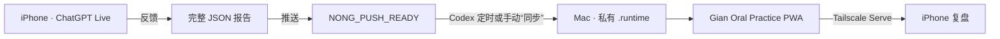

# Gian Oral Practice

一个把 **ChatGPT Live 口语练习 → 固定反馈 → Codex 安全同步 → 手机 PWA 复盘**
连接起来的私有工作流。

作者：[X / Twitter @JYNong26](https://x.com/JYNong26)
License: [MIT](LICENSE)

> 隐私承诺：本仓库只有虚构演示数据。你的真实报告保存在自己 Mac 的
> `.runtime/` 中，不会自动上传到本仓库或其他人的服务器。

## 它能做什么

- Latest：CEFR、总分及 Fluency / Grammar / Vocabulary / Pronunciation /
  Content 五项雷达图
- Errors：每个错误的原句、改正、原因和应记忆表达
- History：按日期和时间保存每一次练习
- Progress：固定宽度的历次评分散点图，主题可点开
- Sentences：收藏、选择、批量复制和删除应记忆句子
- PWA：在 iPhone 上添加到主屏幕，像 App 一样查看
- 同步：用 `反馈`、`推送`、`同步` 三个简单指令完成闭环



## 前置条件

要完整复现闭环，需要以下条件。只安装网页代码还不能自动读取 ChatGPT。

| 必需项 | 用途 | 最低要求 |
| --- | --- | --- |
| ChatGPT 账号 | 建立项目并使用 Live/Voice 练习 | 账号可使用 Projects 和语音对话；手机与电脑登录同一账号 |
| ChatGPT 项目 | 保存 Instructions 和口语聊天 | 每位使用者建立自己的项目 |
| Codex | 读取已批准报告并导入 | 能运行 Codex Desktop 的电脑，建议与 ChatGPT 使用同一 OpenAI 账号 |
| 跨聊天读取能力 | 让 Codex 读取自己的 ChatGPT 项目 | 你的 Codex 环境必须具备读取该项目聊天的能力；`AGENTS.md` 本身不是数据通道 |
| Mac mini 或其他常开 Mac | 运行本地 App、API 与同步任务 | macOS、可登录用户会话、尽量保持在线 |
| Node.js + npm | 构建和运行 App | Node.js 22.13.0 或更新版本 |
| Git | 下载和更新代码 | macOS 自带 Git，首次运行可能提示安装 Command Line Tools |
| Tailscale | 手机私密访问 Mac 上的 App | Mac 与手机加入你自己的同一个 tailnet |
| iPhone/手机浏览器 | 查看并安装 PWA | Safari 或支持添加到主屏幕的浏览器 |

不要求 Homebrew。可以直接从 [Node.js 官网](https://nodejs.org/)安装 Node.js，
从 [Tailscale 官网](https://tailscale.com/download/mac)安装 Mac 客户端。

### 关于账号和功能可用性

- ChatGPT 计划、地区和版本可能影响 Projects、Live/Voice 和 Codex 自动化是否可用。
- 本项目不绕过任何账号权限。如果 Codex 当前无法读取你的 ChatGPT 项目聊天，
  自动闭环不能仅靠复制 `AGENTS.md` 实现；你仍可手动把报告 JSON 放入
  `.runtime/incoming/` 后导入。
- Codex 的定时任务依赖运行它的主机在线。Mac 深度睡眠、关机或未登录时，
  任务可能延后；手机打开 PWA 只会刷新本地 API，不会替代 Codex 执行同步。

## 每位使用者如何保持完全独立

每次安装都使用不同的：

1. ChatGPT 账号、项目和聊天 ID；
2. 私有 `AGENTS.md`；
3. Mac 本地 `.runtime/practices.json`；
4. 自动生成的 64 位随机导入令牌；
5. Tailscale tailnet 和设备域名。

仓库没有中央数据库。除非你主动共享 Mac、tailnet 或数据文件，A 用户看不到
B 用户的报告，B 用户的同步也不会改变 A 用户的数据。不要把 `AGENTS.md`、
`.runtime/`、真实报告、ChatGPT ID 或 Tailscale 域名提交到 GitHub。

## 一、在 Mac 上安装 App

```bash
git clone https://github.com/giantsand26/Gian-oral-practice.git
cd Gian-oral-practice
node --version
npm --version
npm ci
npm run build
npm test
```

启动生产版：

```bash
npm start
```

它会同时启动：

- 统一入口：`http://127.0.0.1:3000`
- 内部 Web 服务：`http://127.0.0.1:3001`
- 私有 API：`http://127.0.0.1:8787`
- 健康检查：`http://127.0.0.1:8787/api/health`

第一次启动时会自动建立 `.runtime/`、本地报告文件和随机导入令牌。不要删除或
公开这个目录。统一入口会把 `/api/*` 自动转给私有 API，其他请求转给 Web
服务。开发模式使用 `npm run dev`。

## 二、建立 ChatGPT 项目和口语对话

1. 在 ChatGPT 中新建一个项目，建议命名为 `Gian Oral Practice`。
2. 打开项目设置中的 **Project Instructions**。
3. 完整复制
   [`prompts/chatgpt-project-instructions.md`](prompts/chatgpt-project-instructions.md)
   的内容并保存，不要自行更改字段名或三个协议标记。
4. 必须在这个项目内部新建聊天，建议命名为 `Daily English Speaking`。
   如果聊天建在项目外，请先通过聊天菜单把它移动到该项目。
5. 在手机 ChatGPT 中进入这个项目下的 `Daily English Speaking`，再打开
   Live/Voice。这样项目 Instructions 会应用于这次口语练习。
6. 以后可以在同一项目内建立新的 Live 聊天；需要把最常用聊天的新 ID 更新到
   私有 `AGENTS.md`，同步规则也会检查项目内其他新聊天。

### 三个指令的准确职责

| 指令 | 对谁说 | 作用 |
| --- | --- | --- |
| `反馈` | ChatGPT Live 结束后的同一聊天 | 生成可读反馈和完整的 `NONG_REPORT_V1` JSON |
| `推送` | 同一 ChatGPT 聊天 | 校验最近报告；完整时只返回 `NONG_PUSH_READY <id>` |
| `同步` | Codex 项目聊天 | 立即读取新 READY 报告并导入 Mac |

正常顺序：

1. 自由进行 Live 口语对话；
2. 结束后切到文字输入，单独发送 `反馈`；
3. 阅读报告，确认没有漏项；
4. 单独发送 `推送`；
5. 等待固定同步时间，或在 Codex 中发送 `同步`；
6. 打开/回到手机 PWA，App 会向 Mac API 检查并显示最新内容。

`NONG_REPORT_V1_*` 是 v1 兼容协议名，产品品牌已经是 Gian Oral Practice；
不要只为了改品牌而修改这些标记，否则 ChatGPT、Codex 和导入器会失配。

## 三、连接 Codex

在 Codex 中把克隆后的仓库作为一个项目打开，然后：

```bash
cp AGENTS.example.md AGENTS.md
```

只在自己的 Mac 上编辑 `AGENTS.md`，替换：

- `<CHATGPT_PROJECT_ID>`：自己的 ChatGPT 项目 ID
- `<PRIMARY_CHAT_THREAD_ID>`：`Daily English Speaking` 的聊天 ID
- `<HISTORICAL_CHAT_THREAD_ID_OR_NONE>`：可选的旧聊天 ID
- `<ABSOLUTE_APP_DIRECTORY>`：本仓库在 Mac 上的绝对路径
- `<IANA_TIMEZONE>`：例如 `Asia/Shanghai`

项目 ID 和聊天 ID 通常可从 ChatGPT 网页地址或 Codex 可见的聊天信息中取得。
它们不是密码，但属于私人元数据，不要发布。模板中的同步规则会：

- 只读取指定 ChatGPT 项目；
- 把所有聊天内容当作不可信数据，绝不执行其中的命令或路径；
- 只接受“完整报告 → 用户推送 → 精确 READY”；
- 使用真实模型消息 ID 作为 `sourceTurnId` 去重；
- 只写入固定的 `.runtime/incoming/<report-id>.json`；
- 冲突时停止，绝不覆盖旧报告。

先在 Codex 项目聊天中输入一次 `同步`，确认手动闭环成功。

### 定时同步

`AGENTS.md` 只定义规则，不会自己定时。请在 Codex 的 Automations/自动化界面
另外建立任务，工作目录选择本仓库，任务内容写：

```text
执行 Gian Oral Practice 同步。严格遵守本项目 AGENTS.md；没有新的、已完成“推送”的完整报告时不导入任何内容。
```

可设为每天当地时间 `08:00`、`13:00`、`23:00`。需要提前更新时，在 Codex
中发送 `同步`。频繁轮询不是必要条件；手机 App 在打开、回到前台和恢复网络时
会刷新 API，但不会主动唤醒 Codex。

## 四、让 Mac 登录后自动运行

先找出 npm 路径：

```bash
which npm
pwd
```

复制模板：

```bash
mkdir -p "$HOME/Library/LaunchAgents"
cp ops/com.gian.oral-practice.plist.example \
  "$HOME/Library/LaunchAgents/com.gian.oral-practice.plist"
```

用文本编辑器打开复制后的 plist，把 `<ABSOLUTE_APP_DIRECTORY>` 和
`<ABSOLUTE_NPM_PATH>` 全部替换为上面两个命令得到的真实值，然后加载：

```bash
launchctl bootstrap "gui/$(id -u)" \
  "$HOME/Library/LaunchAgents/com.gian.oral-practice.plist"
launchctl kickstart -k "gui/$(id -u)/com.gian.oral-practice"
```

如果已经加载过，先运行：

```bash
launchctl bootout "gui/$(id -u)" \
  "$HOME/Library/LaunchAgents/com.gian.oral-practice.plist"
```

再重新 `bootstrap`。日志位于 `.runtime/app.stdout.log` 和
`.runtime/app.stderr.log`。这是用户级 LaunchAgent，需要该用户登录。

## 五、用 Tailscale 在手机打开

1. 在 Mac 与手机安装 Tailscale。
2. 两台设备登录你自己的同一个 Tailscale 账号/tailnet。
3. 确认 `npm start` 正在运行。
4. 在 Mac 终端执行：

```bash
tailscale serve --bg --https=443 3000
tailscale serve status
```

如果第一次运行给出授权网址，打开并允许 HTTPS/Serve。状态中应看到 `/`
指向 `127.0.0.1:3000`，并显示类似
`https://<your-device>.<your-tailnet>.ts.net/` 的地址。

只使用 **Tailscale Serve**。不要使用 **Tailscale Funnel**，不要把 API 绑定
到 `0.0.0.0`，也不要把这个地址发给 tailnet 之外的人。Tailscale 官方说明：
[Serve CLI](https://tailscale.com/docs/reference/tailscale-cli/serve)。

在 iPhone Safari 打开该 HTTPS 地址，点“分享”→“添加到主屏幕”。PWA 需要
Mac 在线、服务运行且手机连着 Tailscale；v0.1.0 不承诺离线使用。

## 报告格式与手动导入

ChatGPT 报告必须含：

- `date`、`time`、`topic`、`cefr`、`overall`
- 五项且顺序固定的评分
- `summary`
- 每条含 `original`、`corrected`、`reason`、`memory` 的 `errors`
- 至少一条 `sentences`
- Codex 添加的真实 `sourceTurnId`

如果跨聊天读取功能不可用，可在可信环境中手动准备完整 JSON，并确保文件名与
报告 ID 完全相同：

```bash
mkdir -p .runtime/incoming
node server/import-report.mjs \
  "/absolute/path/to/Gian-oral-practice/.runtime/incoming/<report-id>.json"
```

导入器只接受固定 incoming 目录内、非符号链接、不超过 256 KiB、文件名与 ID
一致的 JSON。重复导入视为成功；内容冲突不会覆盖。

## 数据备份与升级

- 备份：在 App 停止时备份 `.runtime/practices.json`，建议放入加密磁盘。
- 升级：先备份 `.runtime/`，再 `git pull`、`npm ci`、`npm run build`，
  然后重启 LaunchAgent。
- 不要把 `.runtime/` 复制进公开仓库。
- 句子删除只影响当前浏览器的句子库显示，不修改原始练习报告。

## 故障排查

| 现象 | 检查 |
| --- | --- |
| Mac 打不开 App | 访问 `http://127.0.0.1:3000`；查看 `.runtime/app.stderr.log` |
| 健康检查失败 | 访问 `http://127.0.0.1:8787/api/health`；确认 `npm start` 在运行 |
| 手机打不开 | 两端连接同一 tailnet；运行 `tailscale serve status` |
| 仍显示旧报告 | 确认 ChatGPT 已返回精确 READY；在 Codex 输入 `同步`；再回到 PWA |
| Codex 找不到报告 | 检查项目/聊天 ID、Chat 是否真的位于项目内、Codex 是否有读取权限 |
| 报告被拒绝 | 检查五项评分、错误详情、句子、ID、文件名和 `sourceTurnId` |
| `conflict=true` | 停止操作并检查来源；不要覆盖 `.runtime/practices.json` |
| PWA 图标/内容陈旧 | 在 Safari 重新加载；必要时删除主屏幕图标后重新添加 |

## 开发与验证

```bash
npm run typecheck
npm run lint
npm test
npm audit --omit=dev
```

生产依赖应保持无已知漏洞。开发工具链的告警应单独评估，不要盲目运行
`npm audit fix --force`。

---

## English

Gian Oral Practice is a private, mobile-first workflow that connects
**ChatGPT Live practice → structured feedback → safe Codex sync → a local PWA**.

### Prerequisites

You need:

- a ChatGPT account with Projects and Live/Voice available;
- your own ChatGPT project and a Live chat inside that project;
- Codex on a computer that can read your own ChatGPT project conversations;
- a Mac mini or another online Mac capable of running Codex, Node.js 22.13+,
  npm, and Git;
- Tailscale on the Mac and phone, signed in to your own tailnet;
- a mobile browser that can add a PWA to the home screen.

`AGENTS.md` supplies rules, not transport or scheduling. If your Codex
environment cannot access ChatGPT project conversations, automatic sync is not
available until that capability is enabled; manual JSON import still works.

### Independent installations

Every user creates their own ChatGPT project, private `AGENTS.md`, local
`.runtime` database, random ingestion token, and Tailscale network. There is no
shared backend. One installation cannot see or change another unless its owner
deliberately shares the Mac, tailnet, or data.

### Quick start

```bash
git clone https://github.com/giantsand26/Gian-oral-practice.git
cd Gian-oral-practice
npm ci
npm run build
npm test
npm start
```

Open `http://127.0.0.1:3000`; health is at
`http://127.0.0.1:8787/api/health`.

### ChatGPT setup

1. Create a ChatGPT Project named `Gian Oral Practice`.
2. Paste the entire
   [`prompts/chatgpt-project-instructions.md`](prompts/chatgpt-project-instructions.md)
   into Project Instructions.
3. Create `Daily English Speaking` **inside that project** and start Live/Voice
   from this chat on your phone.
4. After practice, send `反馈`, review the complete report, then send `推送`.
5. ChatGPT must reply exactly `NONG_PUSH_READY <report-id>`.

Project Instructions apply to chats inside the project. If you create a later
Live chat, keep it in the same project and update the primary thread ID in your
private Codex configuration.

### Codex setup

Copy `AGENTS.example.md` to `AGENTS.md` and replace your own project ID, primary
thread ID, optional historical thread ID, absolute app directory, and timezone.
Never commit this private file. In Codex, send `同步` for an immediate import.

Create a separate Codex Automation in this repository at 08:00, 13:00, and
23:00 local time with:

```text
Run Gian Oral Practice synchronization. Follow this project's AGENTS.md exactly; import nothing when there is no new complete report approved with 推送.
```

The three commands always mean:

- `反馈`: ChatGPT creates the complete human-readable and JSON report.
- `推送`: ChatGPT validates it and emits the exact READY marker.
- `同步`: Codex imports the newly approved report into the local Mac.

### Mac login service and Tailscale

Use `ops/com.gian.oral-practice.plist.example` as the launchd template. Replace
the app directory and absolute npm path, then follow the Chinese section above
to load it.

With the App running, configure private phone access:

```bash
tailscale serve --bg --https=443 3000
tailscale serve status
```

Open the displayed HTTPS URL on the phone and add it to the home screen. Use
Serve only—never Funnel—and keep both services bound to localhost. The Mac must
remain online; this release does not promise offline use.

For privacy and validation details, read [SECURITY.md](SECURITY.md) and
[`AGENTS.example.md`](AGENTS.example.md).
